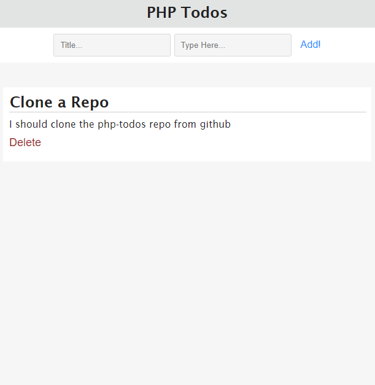

<h1 align="center">PHP Todos</h1>

Invite me to work on projects : [Twitter](https://twitter.com/Merlee4t), [Facebook](https://facebook.com/Merlee4t)

HTML / CSS / PHP / MYSQL
## How to get Started 😁
###  Using Xampp
1. Clone the repository into the htdocs folder on your local machine.
2. Create a database called `phptodos`.
    ## `CREATE DATABASE phptodos;`
3. Create a table called `tasks`.
    ```sql
    CREATE TABLE `tasks` (
        `id` int(11) PRIMARY KEY AUTO_INCREMENT NOT NULL,
        `title` text NOT NULL,
        `task` text NOT NULL
    );
    ```
---

<br/>

### You're All Set. Enjoy 😊
   
   <br/>
Checkout my other Projects here : [github.com/Merlee4](https://github.com/Merlee4)
<br/>
___
Invite me to work on projects : [Twitter](https://twitter.com/Merlee4t), [Facebook](https://facebook.com/Merlee4t)
<br/>
### 
